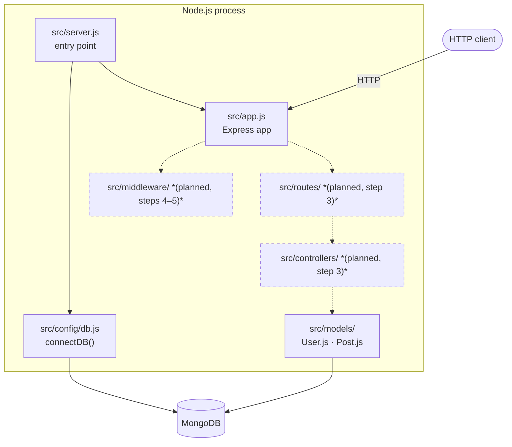
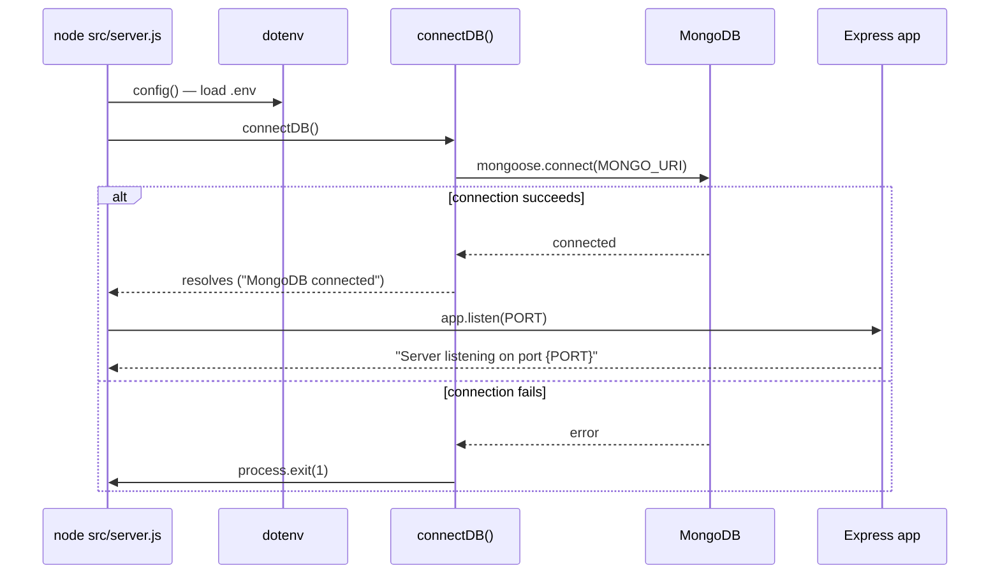
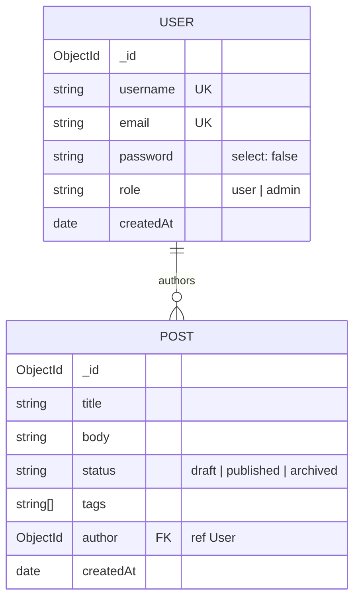

# Architecture

Current as of step 2 (`step-2-mongoose-schemas`). Sections marked *(planned)* describe
work scheduled for later steps and do not exist in the code yet.

## Overview

A conventional layered Express + Mongoose backend. The entry point (`server.js`) is kept
separate from the Express app definition (`app.js`) so the app can be imported by tests
or tooling without opening a port or touching the database.

Solid arrows are wired today; dashed arrows are the planned step-3+ layering. As of
step 2 the models are defined and registered with Mongoose but not yet imported by
`app.js` — nothing routes to them until step 3.

## Boot sequence

`server.js` refuses to listen until MongoDB is reachable — a fail-fast policy so a
misconfigured `MONGO_URI` surfaces immediately instead of as 500s under load.

## Request flow

Today only one route exists:

| Method | Route | Handler | Response |
|--------|-------|---------|----------|
| GET | `/health` | inline in `app.js` | 200 `{"status":"ok"}` |

Global middleware: `express.json()` (malformed JSON bodies are rejected with 400 by
Express's default error handling). Unknown routes fall through to Express 5's default
404. Step 3 mounts resource routers (e.g. `app.use('/api/posts', ...)`) at the
placeholder comment in `app.js`; step 5 replaces the default error handling with a
central error-handling middleware.

## Module responsibilities

| Module | Responsibility | Deliberately does NOT |
|--------|----------------|-----------------------|
| `src/server.js` | Load env, connect DB, start listening | Define routes or middleware |
| `src/app.js` | Assemble the Express app (middleware + routes), export it | Read env vars, open ports, or connect to the DB |
| `src/config/db.js` | Single `connectDB()` — connect or `process.exit(1)` | Retry/backoff (fail-fast is intentional at this stage) |
| `src/models/*.js` | Schema definitions, validation rules, indexes | Hashing, auth, or request handling (step 4's job) |

## Data model

Two collections, one relationship: `Post.author` is an `ObjectId` referencing `User`
(a reference, not an embedded subdocument). See [DESIGN.md](DESIGN.md) for field-level
detail and the rationale behind each choice.

## Build history

Work proceeds one branch per step, merged to `main` by PR.

| Commit | Change |
|--------|--------|
| `c5e5b14` | Initial commit |
| `31ed5f2` | `.gitignore` for Claude artifacts and specs |
| `c86a0c2` | Initial (empty) ARCHITECTURE.md and DESIGN.md placeholders |
| `811d1cf` | `.env.example` (PORT, MONGO_URI, JWT_SECRET) |
| `315724e` | `package.json` + dependencies (express, mongoose, dotenv, nodemon) |
| `35ff64d` | Express app with `/health` endpoint (`src/app.js`) |
| `033ecbc` | Entry point wiring app + DB connection (`src/server.js`) |
| `6525abf` | `connectDB()` utility (`src/config/db.js`) |
| `6bd3770` | `.gitkeep` files for `controllers/`, `routes/`, `middleware/`, `models/` |
| `0ea61e9` | Merge PR #1 — step 1 complete |
| *(uncommitted, step 2)* | `src/models/User.js`, `src/models/Post.js` |
