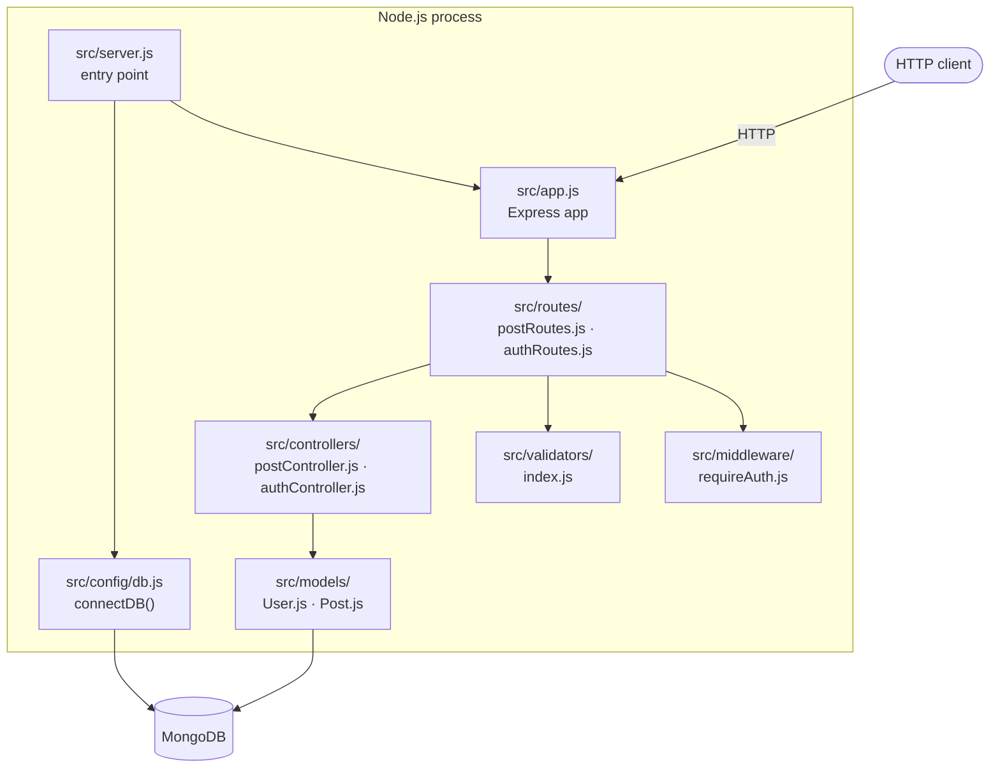
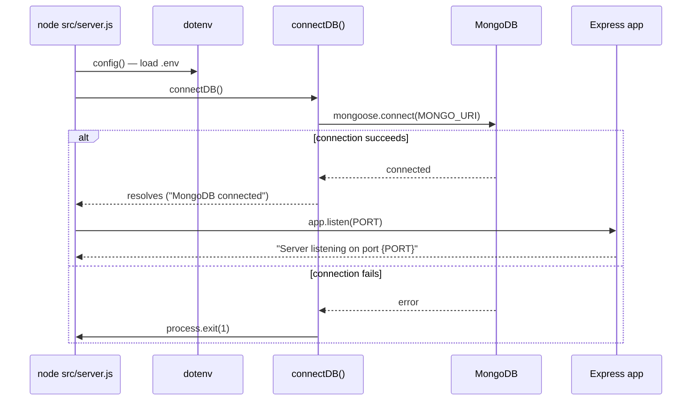
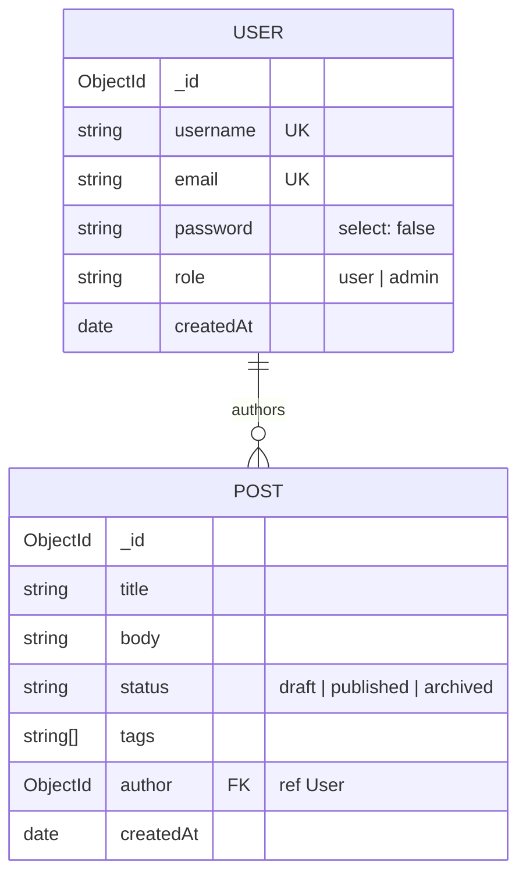

# Architecture

Current as of step 4 (`step-4-auth-validation`). Sections marked *(planned)* describe
work scheduled for later steps and do not exist in the code yet.

## Overview

A conventional layered Express + Mongoose backend. The entry point (`server.js`) is kept
separate from the Express app definition (`app.js`) so the app can be imported by tests
or tooling without opening a port or touching the database.

As of step 4 the full layering is live: routes run `requireAuth` and the
express-validator chains before their controllers, and the auth pair
(`/api/auth/register`, `/api/auth/login`) issues the JWTs the middleware verifies.
The step-5 centralized error handler is the one remaining planned piece.

## Boot sequence

`server.js` refuses to listen until MongoDB is reachable — a fail-fast policy so a
misconfigured `MONGO_URI` surfaces immediately instead of as 500s under load.

## Request flow

| Method | Route | Middleware chain | Response |
|--------|-------|------------------|----------|
| GET | `/health` | — (inline in `app.js`) | 200 `{"status":"ok"}` |
| POST | `/api/auth/register` | validation → `authController.register` | 201 `{ token, user }` / 400 / 409 |
| POST | `/api/auth/login` | validation → `authController.login` | 200 `{ token, user }` / 400 / 401 |
| GET | `/api/posts` | `postController.listPosts` | 200 `{ data, page, limit, total, totalPages }` |
| GET | `/api/posts/:id` | `postController.getPost` | 200 post (author populated) / 404 |
| POST | `/api/posts` | `requireAuth` → validation → `createPost` | 201 post / 400 / 401 |
| PUT | `/api/posts/:id` | `requireAuth` → validation → `updatePost` | 200 post / 400 / 401 / 403 / 404 |
| DELETE | `/api/posts/:id` | `requireAuth` → `deletePost` | 204 / 401 / 403 / 404 |

Protected routes run `requireAuth` first (a request without a valid
`Authorization: Bearer <token>` gets 401 before validation can leak anything), then
the express-validator chains with the shared `handleValidationErrors` collector, then
the controller. `requireAuth` verifies the JWT against `JWT_SECRET` and sets
`req.user = { id, role }` — the shape `authorizePostMutation` consumes. Reads populate
`author` down to `username` and `email` only. Error responses use the target envelope
`{ error: { message, status, details } }`, produced for now by `src/utils/sendError.js`;
step 5 replaces it with a central error-handling middleware without changing the shape.

Global middleware: `express.json()` (malformed JSON bodies are rejected with 400 by
Express's default error handling). Unknown routes fall through to Express 5's default
404.

## Module responsibilities

| Module | Responsibility | Deliberately does NOT |
|--------|----------------|-----------------------|
| `src/server.js` | Load env, connect DB, start listening | Define routes or middleware |
| `src/app.js` | Assemble the Express app (middleware + routes), export it | Read env vars, open ports, or connect to the DB |
| `src/config/db.js` | Single `connectDB()` — connect or `process.exit(1)` | Retry/backoff (fail-fast is intentional at this stage) |
| `src/models/*.js` | Schema definitions, validation rules, indexes; `User.js` owns bcrypt hashing (pre-save hook) + `comparePassword` | Request handling or token issuing |
| `src/middleware/requireAuth.js` | Verify Bearer JWT, set `req.user { id, role }` | Ownership checks (controller's job) or token issuing |
| `src/validators/index.js` | express-validator chains + shared 400 collector | Business rules; Mongoose validation remains the last line of defense |
| `src/controllers/authController.js` | Register/login, JWT signing, public user serialization | Password hashing (model's job) |
| `src/utils/sendError.js` | Interim error envelope | — (deleted in step 5) |

## Data model

Two collections, one relationship: `Post.author` is an `ObjectId` referencing `User`
(a reference, not an embedded subdocument). See [DESIGN.md](DESIGN.md) for field-level
detail and the rationale behind each choice.

## Build history

Work proceeds one branch per step, merged to `main` by PR.

| Commit | Change |
|--------|--------|
| `c5e5b14` | Initial commit |
| `31ed5f2` | `.gitignore` for Claude artifacts and specs |
| `c86a0c2` | Initial (empty) ARCHITECTURE.md and DESIGN.md placeholders |
| `811d1cf` | `.env.example` (PORT, MONGO_URI, JWT_SECRET) |
| `315724e` | `package.json` + dependencies (express, mongoose, dotenv, nodemon) |
| `35ff64d` | Express app with `/health` endpoint (`src/app.js`) |
| `033ecbc` | Entry point wiring app + DB connection (`src/server.js`) |
| `6525abf` | `connectDB()` utility (`src/config/db.js`) |
| `6bd3770` | `.gitkeep` files for `controllers/`, `routes/`, `middleware/`, `models/` |
| `0ea61e9` | Merge PR #1 — step 1 complete |
| `594f745` | Post model (`src/models/Post.js`) |
| `c9ae7a6` | User model (`src/models/User.js`) |
| `6d88872` | Merge PR #2 — step 2 complete |
| `c0886da`–`7645f14` | Step-3 CRUD: controller, routes, `/api/posts` mount, `tags` index |
| `893ecf2` | Merge PR #3 — step 3 complete |
| *(uncommitted, step 4)* | Auth: `authController.js`, `authRoutes.js`, `requireAuth.js`, `validators/`, `utils/sendError.js`, bcrypt hook in `User.js` |
