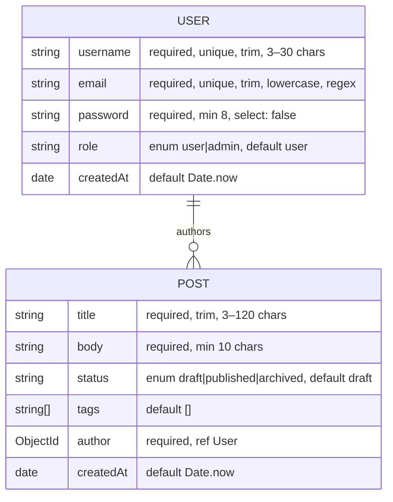

# Design

Rationale for the decisions made in steps 1–6. What the code does lives in
[ARCHITECTURE.md](ARCHITECTURE.md); this file covers *why*.

## Step 1 — server and connection design

- **`app.js` / `server.js` split.** The Express app is defined and exported without
  listening. Tests (and any future tooling) can import the app directly; only
  `server.js` binds a port and touches the database.
- **Fail-fast DB connection.** `connectDB()` calls `process.exit(1)` on failure rather
  than retrying. At this stage of the project a bad `MONGO_URI` should be loud and
  immediate; retry/backoff would have solved the same race an orchestrator can — and
  step 6's Compose healthcheck does exactly that, without touching this code.
- **Config via `.env`.** `dotenv` loads `PORT` and `MONGO_URI`; `.env.example` documents
  defaults. Since step 6, `MONGO_URI` in `.env`/`.env.example` is the host-dev value
  (`localhost`) — Docker Compose sets the container's `MONGO_URI` to `mongo` (the
  Compose service name) itself, via an `environment:` override; see the step-6 section
  below. `JWT_SECRET` was declared from step 1
  so the template was complete ahead of use; step 4 is the first to read it (signing and
  verifying JWTs).

## Step 2 — schema design

### Reference, not embedding

`Post.author` is an `ObjectId` with `ref: 'User'` rather than an embedded user
subdocument. Users are long-lived and mutable (username changes must not require
rewriting every post), and `.populate('author', 'username email')` gives read-side
convenience without duplicating data.

### Field-level decisions

- **`password` uses `select: false`.** Queries never return the hash by accident — every
  `find`/`findOne` excludes it unless the caller opts in. `authController.login` is the
  *only* place that should use `.select('+password')`.
- **`email` uses `lowercase: true` plus `unique`.** Lowercasing before save makes the
  unique index case-insensitive in practice: `Ada@example.com` and `ada@example.com`
  cannot both register.
- **The email regex is deliberately permissive** (`something@something.tld`). Real-world
  email validity is confirmed by delivery, not regex; a strict pattern only rejects
  legitimate unusual addresses.
- **Enums with custom messages** (`role`, `status`) constrain state to known values, and
  every validator uses the `[value, message]` / object form so the central error handler
  (step 5) can flatten `ValidationError` into readable client-facing messages.
- **`createdAt` via `default: Date.now`** rather than `timestamps: true` — `updatedAt`
  isn't needed yet, and adding only what's used keeps documents minimal.

### Indexes

`Post` declares three single-field indexes, sized to the queries step 3 runs:

| Index | Backs |
|-------|-------|
| `{ status: 1 }` | `GET /api/posts?status=published` |
| `{ author: 1 }` | `GET /api/posts?author=<id>` |
| `{ tags: 1 }` | `GET /api/posts?tags=node,express` (multikey — added in step 3) |

(`username` and `email` get unique indexes implicitly from `unique: true`.)

## Step 3 — CRUD and query design

- **Whitelisted filters, never `req.query` spread.** The Mongo filter is built only
  from `status`, `author`, and `tags`. Spreading client query params into a query
  object is an operator-injection vector (`?author[$ne]=x`); a whitelist removes the
  class of bug rather than sanitizing around it. The same discipline applies to the
  create/update body (clients cannot set `_id` or `createdAt`, and `author` is not
  updatable — reassigning ownership would let a user escape the ownership check).
- **`skip`/`limit` pagination.** Simple and matches the spec's
  `{ data, page, limit, total, totalPages }` envelope. Known cost: deep pages make
  Mongo walk and discard `skip` documents, so very deep pagination degrades. At this
  project's scale that's acceptable; a cursor (range-based) scheme is the upgrade path
  if it ever matters. `limit` is unconditionally capped at 100.
- **`tags` multikey index.** `?tags=` is a spec-listed filter on an array field, which
  is exactly what a Mongo multikey index serves — consistent with the `status`/`author`
  indexes added in step 2 for the same reason.
- **Deliberate 400-vs-404 CastError asymmetry.** A malformed `:id` path param is a 404
  (`getPost` — the id names a resource that cannot exist, and the spec groups invalid
  ObjectId casts on lookup under 404), while a malformed `?author=` filter value is a
  400 (`listPosts` — it's a bad request parameter on a collection query, not the
  identity of the requested resource).
- **Sort is not whitelisted.** The sort string is not a query predicate; sorting on a
  non-existent field is a no-op in Mongo, not an injection vector.
- **Interim error envelope.** All errors already use the step-5 target shape
  `{ error: { message, status, details } }` via a local `sendError` helper, so the
  step-5 refactor to central middleware was consumer-invisible (see below).

## Step 4 — auth and validation design

- **`bcryptjs` over native `bcrypt`.** Pure JS, identical API (`hash`/`compare`). The
  payoff lands in step 6: the Docker image needs no build toolchain (`python3`/`make`/
  `g++`) and is free to use a slim base like `node:24-slim`. This project has no
  password-hashing throughput problem for native bcrypt to solve.
- **Hashing lives in the model, not the controller.** A `pre('save')` hook guarded by
  `isModified('password')` means every write path hashes exactly once, and future
  profile-update saves don't re-hash a hash. Mongoose runs validators *before*
  `pre('save')`, so `minlength: 8` checks the plaintext — deliberate, not a bug.
- **Validator/schema defense in depth.** The express-validator chains duplicate the
  schema rules on purpose: they reject bad input before a DB round-trip and report all
  field errors at once, while Mongoose validation remains the last line of defense.
  Both layers emit the same flat `details` array, so clients see one 400 shape.
- **`publicUser` serializer.** `select: false` does not protect the register response —
  `User.create()` returns the document just built, hashed password included (`select`
  only applies to query-loaded documents). Auth responses are built explicitly from
  `{ id, username, email, role }` so the hash cannot leak by construction.
- **`role` is excluded from the register whitelist.** A client cannot self-register as
  `admin`; the schema default (`user`) applies. Promotion is a manual/DB operation.
- **Duplicate registration → 409.** Mongo's `11000` duplicate-key error is mapped to
  409 `'Username or email already in use'` — not 400 (the request was well-formed; it
  conflicts with existing state) and not a 500 fall-through. Step 5 moves this branch
  into the central handler.
- **One `'Invalid email or password'` message** for both unknown-email and wrong-password
  logins — the response must not reveal whether an account exists. Login lowercases the
  incoming email before lookup because the schema's `lowercase: true` normalizes on
  save, not on query.
- **Token design.** Payload is `{ id, role }` with the id stringified at signing so
  `requireAuth` hands `assertCanMutate` (renamed from `authorizePostMutation` in step 5)
  exactly the shape step 3 coded against.
  Expiry is hardcoded at 1h (the spec's value; an env var would be unrequested
  configurability). Bearer-token-in-body response, no cookie — no browser consumes
  this API.
- **`author` comes only from the token.** `createPost` now sets `author: req.user.id`;
  the body field is ignored, closing the forged-authorship hole the step-3 interim
  state documented.

## Step 5 — centralized error handling design

- **Hybrid classification: `AppError` plus a generic `err.name`/`err.code` switch.**
  Framework-thrown errors (Mongoose `ValidationError`/`CastError`, Mongo `11000`, JWT
  errors) are recognized generically in the handler. Anything where the status is a
  *decision this code makes* — 401 no-header, 403 wrong owner, 404 no document, 400
  bad filter value — is thrown explicitly as an `AppError`. The generic switch alone
  can't express those without reinventing per-site response writing.
- **The `isValid()` guard in `listPosts` before the `?author=` filter is applied.**
  It looks like redundant validation — Mongo would reject a malformed ObjectId with a
  `CastError` anyway — but that's exactly the problem it prevents: without it,
  `CastError` would mean two different things (a bad `:id` path param *and* a bad
  `?author=` query value), and the central handler can't tell them apart to pick 404
  vs. 400. Rejecting the malformed filter before it reaches Mongo means `CastError`
  reaching the handler can only ever come from a malformed `:id`, so the handler maps
  it to 404 with no heuristics. Behavior for callers is unchanged: `?author=garbage`
  still returns 400 `'Invalid author id'`, just thrown explicitly instead of caught
  from Mongo.
- **Route "not found" through `next(new AppError(404, ...))`, not a direct response.**
  A missing document isn't technically a thrown error in the abstract, but writing
  `res.status(404).json(...)` at each of the four call sites would resurrect the
  five-places-know-the-shape problem this step exists to remove. One path for every
  error response, no exceptions for 404.
- **Lean on Express 5's async auto-forwarding to delete try/catch.** Express 5.2.1
  forwards a rejected promise from an `async` route handler to `next(err)`
  automatically. Combined with the `isValid()` guard (no ambiguous `CastError` left)
  and explicit `AppError` throws, every controller's `try`/`catch` became pure
  pass-through and was deleted — this took roughly a third of the lines out of
  `postController.js` with zero behavior change.
- **`requireAuth` keeps its `try/catch`.** It is not an `async` function, so Express's
  promise auto-forwarding doesn't apply to it; it must call `next(err)` explicitly to
  reach the handler. The asymmetry with the controllers is deliberate, not an
  oversight left behind by the refactor.
- **500s never include `err.message` or a stack trace in the response body.** The
  fallback branch always responds with the fixed string `'Internal server error'` and
  `details: null`; the real error goes to `console.error` server-side only.
- **Catch-all 404 for unmatched routes.** Before this step, `GET /api/nope` fell
  through to Express's built-in handler and returned an HTML error page — the one
  response in the API that didn't match the documented envelope. `notFound` (mounted
  after every route, before `errorHandler`) closes that gap with a three-line module.

## Step 6 — Docker Compose design

- **Healthcheck + `depends_on: condition: service_healthy` over app-level retry
  logic.** `connectDB()`'s fail-fast `process.exit(1)` was a deliberate, documented
  choice in step 1 and re-justified in step 5 — an orchestration-layer race (Mongo not
  yet accepting connections on a cold start) is an orchestration problem, and Compose
  already has the primitive for it. Reopening finished application code to add
  retry/backoff would solve the same problem worse, in more places. Plain
  `depends_on` alone is not enough: it waits for the `mongo` container to *start*, not
  for `mongosh --eval db.adminCommand('ping')` to succeed, which is the actual race
  the spec's "single `docker compose up`" acceptance bar cares about.
- **`environment:` override for `MONGO_URI`, on top of `env_file: .env`.** The
  developer's real local `.env` holds a credentialed **localhost** URI (what host-mode
  `npm run dev` has needed since step 1). Feeding that file straight to the `api`
  container via `env_file` would point the container at itself, where nothing
  listens, and `connectDB()` would exit 1 on every cold start — the one failure mode
  that most needs to not happen. Host-mode and container-mode need genuinely
  different values for the same variable; one `.env` file cannot hold both. Compose
  applies `environment:` over `env_file:`, so `docker-compose.yml` hardcodes
  `MONGO_URI: mongodb://mongo:27017/app` for the container while `PORT` and
  `JWT_SECRET` still flow through from `.env` normally. Consequence: `.env.example`'s
  `MONGO_URI` flips to the host-dev value (`localhost`), and its header comment now
  explains that Compose ignores it.
- **`node:24-slim` base image.** Matches the local Node version, Debian-based (no
  musl surprises), and needs no build toolchain — which is only possible because step
  4 chose `bcryptjs` over native `bcrypt` for exactly this payoff. That choice pays
  out here.
- **`mongo:7` pinned, not `latest`.** Reproducible builds; `latest` could silently
  jump a major version and break the stack on an unrelated day. `mongo:7` also ships
  `mongosh`, which the healthcheck depends on.
- **Single-stage Dockerfile, `npm ci --omit=dev`.** No build step exists in this
  project (no TypeScript, no bundler), so a multi-stage build would have nothing to
  copy between stages. `--omit=dev` drops `nodemon`, which has no reason to be in a
  container that only ever runs `npm start`.
- **`$` in `.env` values needs `$$` escaping.** Discovered during verification: Compose
  interpolates `$identifier` patterns in values it reads from `.env` — including values
  consumed via `env_file:` for the `api` service, not just `${VAR}` references inside
  `docker-compose.yml` itself. A `JWT_SECRET` containing a literal `$` followed by
  letters/digits/underscore (a realistic shape for a random-generator-produced secret)
  gets that fragment silently dropped, so the container runs with a *different* secret
  than what's written in `.env`, with no error — Compose only warns
  (`"$X" variable is not set. Defaulting to a blank string.`), which is easy to miss
  among normal build output. The stack still functions (both signing and verifying read
  the same, if-mangled, value), but a developer inspecting or reusing the configured
  secret would be misled. `.env.example`'s comment now calls this out explicitly.
- **No authentication on the `mongo` service.** The spec doesn't ask for it, the
  database isn't exposed beyond the developer's own machine, and adding
  `MONGO_INITDB_ROOT_*` credentials would mean threading them into `MONGO_URI` for no
  requirement this project has. This is a conscious local-only scope decision, not an
  oversight — worth stating explicitly because the `27017:27017` host port mapping
  (there so `mongosh`/Compass can reach the containerized data directly) is what makes
  the absence of auth worth noticing at all.

## Known constraints carried forward

These are consequences of the current design that later steps must handle:

1. **Duplicate `username`/`email` is not a `ValidationError`.** Unique-index violations
   surface as `MongoServerError` code `11000`. The central `errorHandler` maps it to
   409.
2. **Login must opt into the password field.** Because of `select: false`, the login
   controller uses `.select('+password')` — it is the only place that should.
3. **`requireAuth` is the only non-async error source and keeps an explicit
   `try/catch`.** Every other error path relies on Express 5's promise
   auto-forwarding or an explicit `throw`/`next(new AppError(...))`; this is the one
   deliberate exception, and it exists because `requireAuth` isn't declared `async`.
4. **The container ignores `.env`'s `MONGO_URI` by design.** `docker-compose.yml`'s
   `environment:` override always wins for the `api` service — changing `MONGO_URI`
   in `.env` has no effect on `docker compose up` runs. It only affects host-mode
   `npm run dev`/`npm start`.
5. **A literal `$` in any `.env` value must be escaped as `$$`** or Compose silently
   drops the fragment it mistakes for a variable reference — see the step-6 design
   note above. Applies to `JWT_SECRET` (and to `MONGO_URI` if a future step adds
   credentials to it), and only under `docker compose up`; host-mode `dotenv` does not
   do this interpolation.
