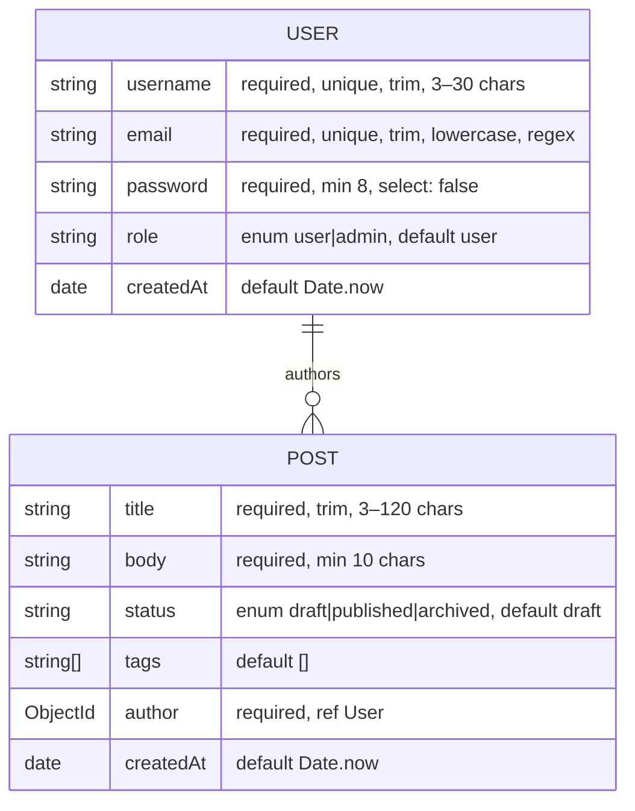

# Design

Rationale for the decisions made in steps 1–2. What the code does lives in
[ARCHITECTURE.md](ARCHITECTURE.md); this file covers *why*.

## Step 1 — server and connection design

- **`app.js` / `server.js` split.** The Express app is defined and exported without
  listening. Tests (and any future tooling) can import the app directly; only
  `server.js` binds a port and touches the database.
- **Fail-fast DB connection.** `connectDB()` calls `process.exit(1)` on failure rather
  than retrying. At this stage of the project a bad `MONGO_URI` should be loud and
  immediate; retry/backoff can be added when there's an orchestrator (step 6, Docker)
  to make restarts meaningful.
- **Config via `.env`.** `dotenv` loads `PORT` and `MONGO_URI`; `.env.example` documents
  defaults. The default `MONGO_URI` host is `mongo` (the planned Docker Compose service
  name); host-local runs override it to `localhost`. `JWT_SECRET` is declared now so the
  template is complete, but nothing reads it until step 4.

## Step 2 — schema design

### Reference, not embedding

`Post.author` is an `ObjectId` with `ref: 'User'` rather than an embedded user
subdocument. Users are long-lived and mutable (username changes must not require
rewriting every post), and `.populate('author', 'username email')` gives read-side
convenience without duplicating data.

### Field-level decisions

- **`password` uses `select: false`.** Queries never return the hash by accident — every
  `find`/`findOne` excludes it unless the caller opts in. The step-4 login controller is
  the *only* place that should use `.select('+password')`.
- **`email` uses `lowercase: true` plus `unique`.** Lowercasing before save makes the
  unique index case-insensitive in practice: `Ada@example.com` and `ada@example.com`
  cannot both register.
- **The email regex is deliberately permissive** (`something@something.tld`). Real-world
  email validity is confirmed by delivery, not regex; a strict pattern only rejects
  legitimate unusual addresses.
- **Enums with custom messages** (`role`, `status`) constrain state to known values, and
  every validator uses the `[value, message]` / object form so step-5's error handler
  can flatten `ValidationError` into readable client-facing messages.
- **`createdAt` via `default: Date.now`** rather than `timestamps: true` — `updatedAt`
  isn't needed yet, and adding only what's used keeps documents minimal.

### Indexes

`Post` declares two single-field indexes, sized to the queries step 3 will actually run:

| Index | Backs |
|-------|-------|
| `{ status: 1 }` | `GET /api/posts?status=published` |
| `{ author: 1 }` | `GET /api/posts?author=<id>` |

(`username` and `email` get unique indexes implicitly from `unique: true`.)

## Known constraints carried forward

These are consequences of the current design that later steps must handle:

1. **Duplicate `username`/`email` is not a `ValidationError`.** Unique-index violations
   surface as `MongoServerError` code `11000`. Step 5's central error handler needs an
   explicit case for it, or registration collisions will 500 instead of 409.
2. **Login must opt into the password field.** Because of `select: false`, step 4's
   login controller must use `.select('+password')` or comparison will always fail.
3. **Passwords are stored as-is until step 4.** The schema validates length only;
   bcrypt hashing is deliberately deferred to the auth step. Do not create real
   accounts before step 4 lands.
4. **No retry on DB connection.** Under Docker Compose (step 6), the API container may
   need a healthcheck/`depends_on` condition (or a connection retry) since Mongo can
   come up slower than the API.
