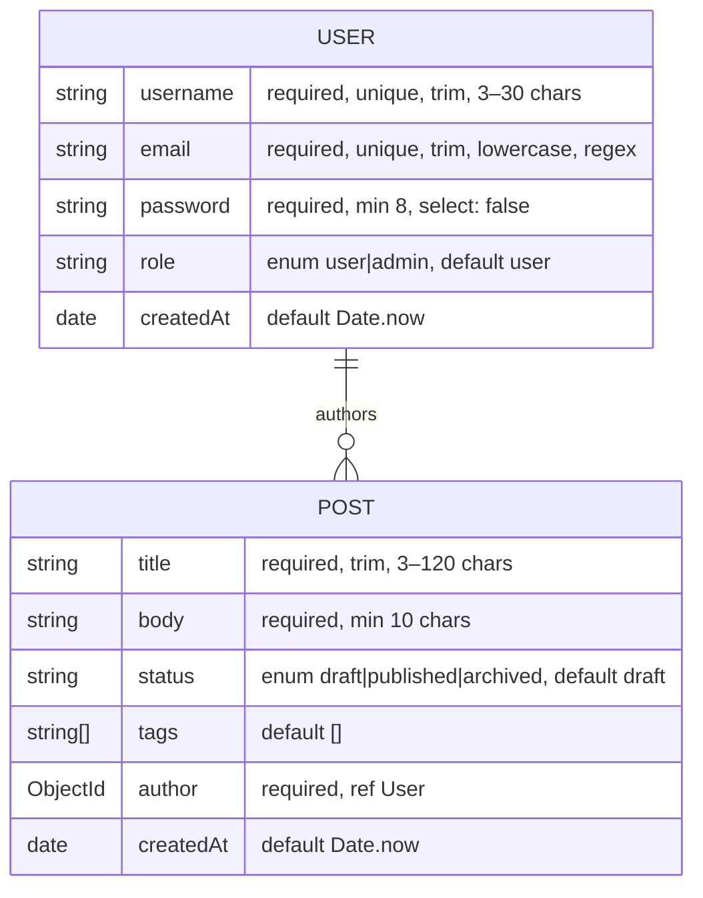

# Design

Rationale for the decisions made in steps 1–4. What the code does lives in
[ARCHITECTURE.md](ARCHITECTURE.md); this file covers *why*.

## Step 1 — server and connection design

- **`app.js` / `server.js` split.** The Express app is defined and exported without
  listening. Tests (and any future tooling) can import the app directly; only
  `server.js` binds a port and touches the database.
- **Fail-fast DB connection.** `connectDB()` calls `process.exit(1)` on failure rather
  than retrying. At this stage of the project a bad `MONGO_URI` should be loud and
  immediate; retry/backoff can be added when there's an orchestrator (step 6, Docker)
  to make restarts meaningful.
- **Config via `.env`.** `dotenv` loads `PORT` and `MONGO_URI`; `.env.example` documents
  defaults. The default `MONGO_URI` host is `mongo` (the planned Docker Compose service
  name); host-local runs override it to `localhost`. `JWT_SECRET` was declared from step 1
  so the template was complete ahead of use; step 4 is the first to read it (signing and
  verifying JWTs).

## Step 2 — schema design

### Reference, not embedding

`Post.author` is an `ObjectId` with `ref: 'User'` rather than an embedded user
subdocument. Users are long-lived and mutable (username changes must not require
rewriting every post), and `.populate('author', 'username email')` gives read-side
convenience without duplicating data.

### Field-level decisions

- **`password` uses `select: false`.** Queries never return the hash by accident — every
  `find`/`findOne` excludes it unless the caller opts in. `authController.login` is the
  *only* place that should use `.select('+password')`.
- **`email` uses `lowercase: true` plus `unique`.** Lowercasing before save makes the
  unique index case-insensitive in practice: `Ada@example.com` and `ada@example.com`
  cannot both register.
- **The email regex is deliberately permissive** (`something@something.tld`). Real-world
  email validity is confirmed by delivery, not regex; a strict pattern only rejects
  legitimate unusual addresses.
- **Enums with custom messages** (`role`, `status`) constrain state to known values, and
  every validator uses the `[value, message]` / object form so step-5's error handler
  can flatten `ValidationError` into readable client-facing messages.
- **`createdAt` via `default: Date.now`** rather than `timestamps: true` — `updatedAt`
  isn't needed yet, and adding only what's used keeps documents minimal.

### Indexes

`Post` declares three single-field indexes, sized to the queries step 3 runs:

| Index | Backs |
|-------|-------|
| `{ status: 1 }` | `GET /api/posts?status=published` |
| `{ author: 1 }` | `GET /api/posts?author=<id>` |
| `{ tags: 1 }` | `GET /api/posts?tags=node,express` (multikey — added in step 3) |

(`username` and `email` get unique indexes implicitly from `unique: true`.)

## Step 3 — CRUD and query design

- **Whitelisted filters, never `req.query` spread.** The Mongo filter is built only
  from `status`, `author`, and `tags`. Spreading client query params into a query
  object is an operator-injection vector (`?author[$ne]=x`); a whitelist removes the
  class of bug rather than sanitizing around it. The same discipline applies to the
  create/update body (clients cannot set `_id` or `createdAt`, and `author` is not
  updatable — reassigning ownership would let a user escape the ownership check).
- **`skip`/`limit` pagination.** Simple and matches the spec's
  `{ data, page, limit, total, totalPages }` envelope. Known cost: deep pages make
  Mongo walk and discard `skip` documents, so very deep pagination degrades. At this
  project's scale that's acceptable; a cursor (range-based) scheme is the upgrade path
  if it ever matters. `limit` is unconditionally capped at 100.
- **`tags` multikey index.** `?tags=` is a spec-listed filter on an array field, which
  is exactly what a Mongo multikey index serves — consistent with the `status`/`author`
  indexes added in step 2 for the same reason.
- **Deliberate 400-vs-404 CastError asymmetry.** A malformed `:id` path param is a 404
  (`getPost` — the id names a resource that cannot exist, and the spec groups invalid
  ObjectId casts on lookup under 404), while a malformed `?author=` filter value is a
  400 (`listPosts` — it's a bad request parameter on a collection query, not the
  identity of the requested resource).
- **Sort is not whitelisted.** The sort string is not a query predicate; sorting on a
  non-existent field is a no-op in Mongo, not an injection vector.
- **Interim error envelope.** All errors already use the step-5 target shape
  `{ error: { message, status, details } }` via a local `sendError` helper, so the
  step-5 refactor to central middleware is consumer-invisible.

## Step 4 — auth and validation design

- **`bcryptjs` over native `bcrypt`.** Pure JS, identical API (`hash`/`compare`). The
  payoff lands in step 6: the Docker image needs no build toolchain (`python3`/`make`/
  `g++`) and is free to use a slim base like `node:24-slim`. This project has no
  password-hashing throughput problem for native bcrypt to solve.
- **Hashing lives in the model, not the controller.** A `pre('save')` hook guarded by
  `isModified('password')` means every write path hashes exactly once, and future
  profile-update saves don't re-hash a hash. Mongoose runs validators *before*
  `pre('save')`, so `minlength: 8` checks the plaintext — deliberate, not a bug.
- **Validator/schema defense in depth.** The express-validator chains duplicate the
  schema rules on purpose: they reject bad input before a DB round-trip and report all
  field errors at once, while Mongoose validation remains the last line of defense.
  Both layers emit the same flat `details` array, so clients see one 400 shape.
- **`publicUser` serializer.** `select: false` does not protect the register response —
  `User.create()` returns the document just built, hashed password included (`select`
  only applies to query-loaded documents). Auth responses are built explicitly from
  `{ id, username, email, role }` so the hash cannot leak by construction.
- **`role` is excluded from the register whitelist.** A client cannot self-register as
  `admin`; the schema default (`user`) applies. Promotion is a manual/DB operation.
- **Duplicate registration → 409.** Mongo's `11000` duplicate-key error is mapped to
  409 `'Username or email already in use'` — not 400 (the request was well-formed; it
  conflicts with existing state) and not a 500 fall-through. Step 5 moves this branch
  into the central handler.
- **One `'Invalid email or password'` message** for both unknown-email and wrong-password
  logins — the response must not reveal whether an account exists. Login lowercases the
  incoming email before lookup because the schema's `lowercase: true` normalizes on
  save, not on query.
- **Token design.** Payload is `{ id, role }` with the id stringified at signing so
  `requireAuth` hands `authorizePostMutation` exactly the shape step 3 coded against.
  Expiry is hardcoded at 1h (the spec's value; an env var would be unrequested
  configurability). Bearer-token-in-body response, no cookie — no browser consumes
  this API.
- **`author` comes only from the token.** `createPost` now sets `author: req.user.id`;
  the body field is ignored, closing the forged-authorship hole the step-3 interim
  state documented.

## Known constraints carried forward

These are consequences of the current design that later steps must handle:

1. **Duplicate `username`/`email` is not a `ValidationError`.** Unique-index violations
   surface as `MongoServerError` code `11000`. The register controller maps it to 409;
   step 5's central error handler must keep an explicit case for it when the branch
   moves there.
2. **Login must opt into the password field.** Because of `select: false`, the login
   controller uses `.select('+password')` — it is the only place that should.
3. **No retry on DB connection.** Under Docker Compose (step 6), the API container may
   need a healthcheck/`depends_on` condition (or a connection retry) since Mongo can
   come up slower than the API.
4. **Every controller still emits errors via the `sendError` util**
   (`src/utils/sendError.js`). Step 5 deletes it and converts all call sites in
   `postController.js`, `authController.js`, `requireAuth.js`, and
   `validators/index.js` to `next(err)` + central middleware; response shapes are
   already final, so the refactor is consumer-invisible.
5. **Step 6 may use a slim Node base image** — `bcryptjs` is pure JS, no build
   toolchain needed. The container's env must supply a real `JWT_SECRET`.
